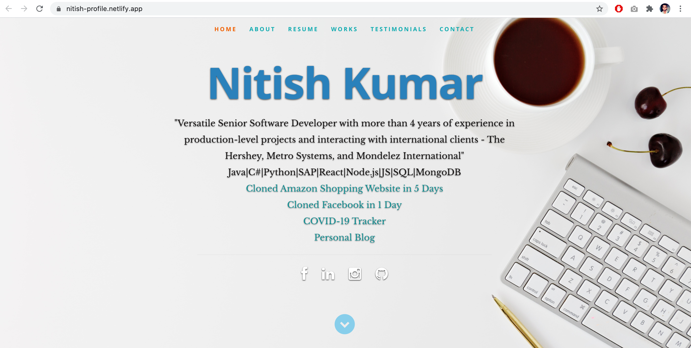

# LearnLive ReactJS Portfolio      
 

## Description
This is a personal resume website created using reactJS.

## Make it Your Own!
#### PREREQUISITES:
- Sign up for a Netlify account <a href='https://www.netlify.com'>HERE</a>
- Install Node JS in your computer <a href='https://nodejs.org/en/'>HERE</a>
#### PROCEDURE:
- Download the zip folder from Github and unzip it
- Open the folder in VS Code
- Edit <code>public/resumeData.json</code> and add your personal details and projects
- Open terminal in VS Code
- RUN <code>npm init</code> , this command can be used to set up a new or existing npm package
- RUN <code>npm install</code> , this command pulls out all the require node modules
- RUN <code>npm run build</code>, this command will create a build folder for you
- DRAG AND DROP the BUILD folder on Netlify, your app is live now for the world to see

## Credits

#### All Credits Goes to Tim Baker <a href='https://github.com/tbakerx/react-resume-template'>Original Repo</a>

HTML Design Template
<a href="https://www.styleshout.com/free-templates/ceevee/">Ceevee Template by Styleshout</a>

